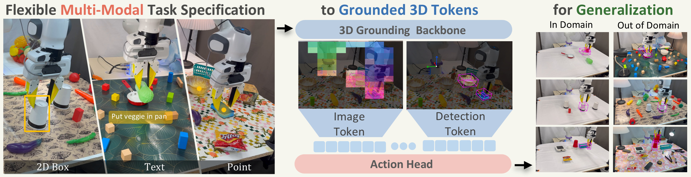

<h1 align="center">Grounded Action Model:<br>3D Grounding as a Foundation for Robotics</h1>

<p align="center">
  <a href="https://arxiv.org/abs/2609.23863"></a>
  <a href="https://grounded-action-model.github.io/"></a>
  
</p>

<p align="center">
  Gehao Zhang<sup>1</sup> ·
  Weikai Huang<sup>2</sup> ·
  Shailesh Shailesh<sup>3</sup> ·
  Yiyan Peng<sup>1</sup> ·
  Jiafei Duan<sup>3</sup> ·
  Ranjay Krishna<sup>2,4</sup>
  <br>
  <sup>1</sup>Northwestern University &nbsp; <sup>2</sup>University of Washington &nbsp;
  <sup>3</sup>National University of Singapore &nbsp; <sup>4</sup>Microsoft
</p>

<p align="center">
  
</p>

## 🚧 Code coming soon

We are preparing the release of training and inference code, pretrained checkpoints and the
real-robot evaluation setup. Watch this repository to be notified.

In the meantime:

- 📄 **Paper**: [arXiv:2609.23863](https://arxiv.org/abs/2609.23863)
- 🌐 **Project page** (videos, results, interactive figures): [grounded-action-model.github.io](https://grounded-action-model.github.io/)

## Abstract

Manipulation policies must know which objects matter and where they are, yet the pretrained
backbones that current robot foundation models build on, from language in vision-language-action
models (VLAs) to video generation in world-action models (WAMs), do not directly require this
metric grounding, leaving it to be learned implicitly from robot demonstrations. We propose
**Grounded Action Models (GAMs)**, a new paradigm of robot foundation models built with 3D
grounding. GAM can be conditioned using language, points, or box prompts, which are first
transformed into a shared object-centric representation of the selected objects. This
representation captures target-focused visual features and metric object geometry, which is mixed
with robot state history through a multi-stream transformer to predict action chunks. Although
GAMs can be run autonomously, they can also serve as a low-level controller that a high-level
planner controls using its various input modalities, allowing for long-horizon and
memory-dependent manipulation.

On RoboTwin 2.0, GAM achieves an average success rate of **55.3%** across 50 tasks (vs. 52.0% for
Spatial Forcing), including **47.6%** under scene randomization (vs. 30.4% for Abot-M0), with its
action policy trained only on clean-scene demonstrations. On LIBERO-PRO, it achieves a
state-of-the-art average success rate of **61%** (vs. 53% for π<sub>0.5</sub>) across 16 perturbation
settings. On two real robots, GAM retains **17/20** successes under visual shift on a bimanual YAM
versus 4/20 for π<sub>0.5</sub>, while its composition with a Molmo2 planner on a Franka achieves
64.7% ID and 49.8% OOD step completion on long-horizon and memory-dependent tasks.

## Citation

```bibtex
@misc{zhang2026groundedactionmodel3d,
  title         = {Grounded Action Model: 3D Grounding as a Foundation for Robotics},
  author        = {Gehao Zhang and Weikai Huang and Shailesh Shailesh and Yiyan Peng and Jiafei Duan and Ranjay Krishna},
  year          = {2026},
  eprint        = {2609.23863},
  archivePrefix = {arXiv},
  primaryClass  = {cs.RO},
  url           = {https://arxiv.org/abs/2609.23863}
}
```
