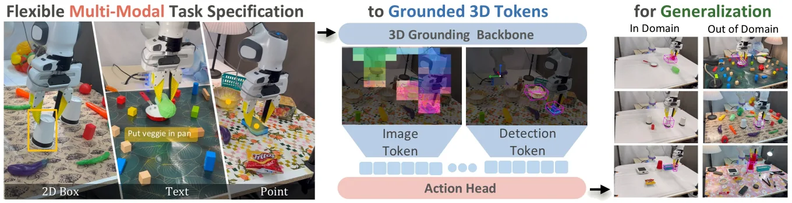

<h1 align="center">Grounded Action Model:<br>3D Grounding as a Foundation for Robotics</h1>

<p align="center">
  <a href="https://arxiv.org/abs/2609.23863"></a>
  <a href="https://grounded-action-model.github.io/"></a>
</p>

<p align="center">
  Gehao Zhang<sup>1</sup> ·
  Weikai Huang<sup>2</sup> ·
  Shailesh Shailesh<sup>3</sup> ·
  Yiyan Peng<sup>1</sup> ·
  Jiafei Duan<sup>3</sup> ·
  Ranjay Krishna<sup>2,4</sup>
  <br>
  <sup>1</sup>Northwestern University &nbsp; <sup>2</sup>University of Washington &nbsp;
  <sup>3</sup>National University of Singapore &nbsp; <sup>4</sup>Microsoft
</p>

<video src="https://github.com/GehaoZhang6/Grounded-Action-Model/raw/main/assets/demo.mp4" width="100%" controls autoplay muted loop playsinline></video>

<p align="center">
  
</p>

<br>

<h2 align="center">🚧 &nbsp;Code coming soon&nbsp; 🚧</h2>

<p align="center">
  Training and inference code, pretrained checkpoints and the real-robot setup are being prepared for release.<br>
  <b>Watch</b> this repository to be notified. In the meantime, see the
  <a href="https://arxiv.org/abs/2609.23863">paper</a> and the
  <a href="https://grounded-action-model.github.io/">project page</a>.
</p>

<br>

## Citation

```bibtex
@misc{zhang2026groundedactionmodel3d,
  title         = {Grounded Action Model: 3D Grounding as a Foundation for Robotics},
  author        = {Gehao Zhang and Weikai Huang and Shailesh Shailesh and Yiyan Peng and Jiafei Duan and Ranjay Krishna},
  year          = {2026},
  eprint        = {2609.23863},
  archivePrefix = {arXiv},
  primaryClass  = {cs.RO},
  url           = {https://arxiv.org/abs/2609.23863}
}
```
